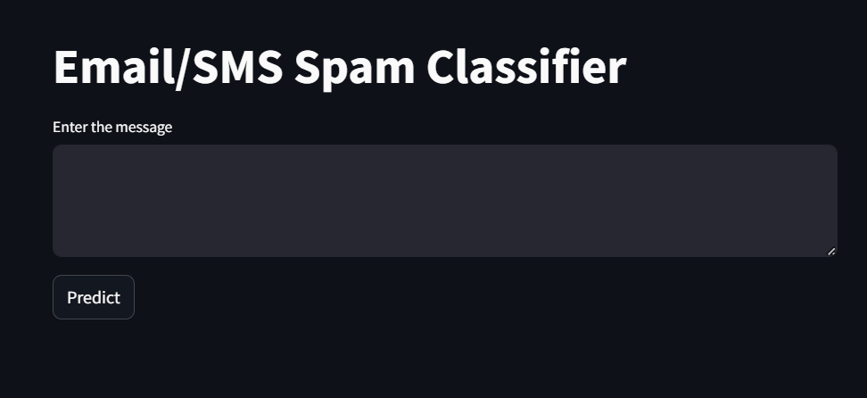
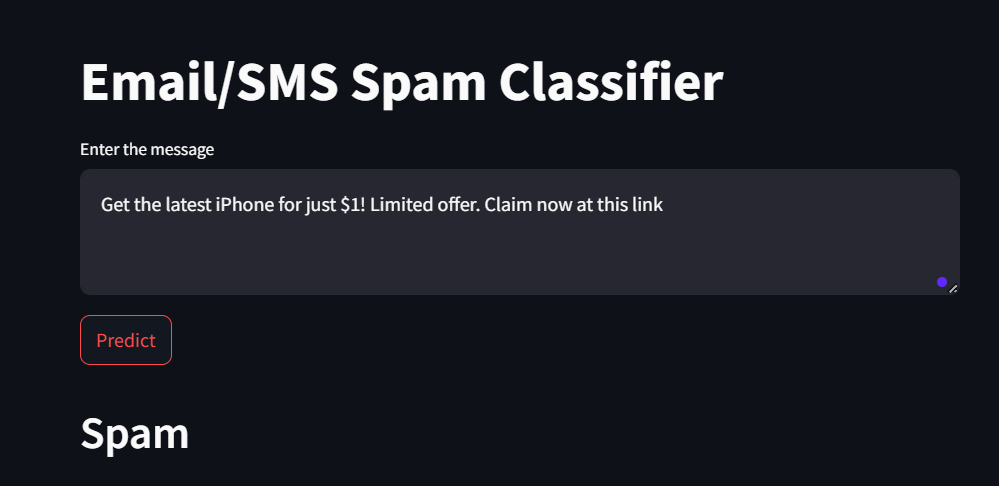
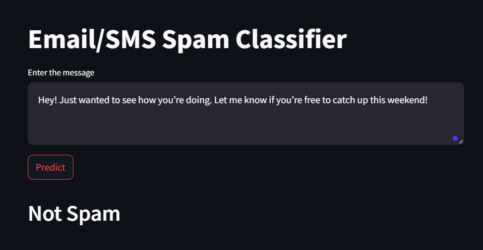
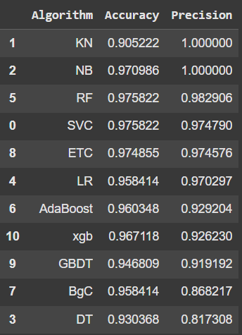

# 📧 Email Spam Classifier 🚀

**Detect spam emails effortlessly with cutting-edge machine learning algorithms!**  
This project leverages the power of natural language processing (NLP) and classification models to identify whether an email is spam or not.  



---
## 🌟 Features

The **Email Spam Classifier** delivers an efficient and versatile solution for spam detection, designed to meet the needs of both developers and end-users. Here's what makes it stand out:

---

### 🔍 1. Advanced Spam Detection
- **High Accuracy**: Detects spam emails with precision using a mix of well-tuned algorithms.
- **Real-Time Analysis**: Processes email content instantly to provide predictions on the fly.
---

### 🛠️ 2. Flexible Architecture
- **Plug-and-Play Design**: Swap out models or preprocessing steps without disrupting the workflow.
- **Dataset Agnostic**: Compatible with diverse datasets, such as email corpora, SMS datasets, and more.
- **Support for Multiple Algorithms**:
  - Lightweight models like **Naive Bayes** for quick predictions.
  - Advanced techniques like **SVM** for higher accuracy in edge cases.

---

### 🖥️ 3. Interactive Dashboard
- Powered by **Streamlit** for an engaging and intuitive experience.
- **User Input Options**:
  - Upload email files directly.
  - Paste email text for instant classification.
- **Clear Results**: Displays classification results with easy-to-read labels.

---

### 📊 4. Performance Monitoring
- **In-Depth Metrics**:
  - Offers evaluation statistics, including precision, recall, and F1-score.
  - Tracks false positives and negatives for continuous improvements.
- **Visual Analytics**:
  - Graphs and plots to showcase training performance and trends.
  - Interactive tools to visualize confusion matrices and accuracy curves.
---
## 🖼️ Screenshots

### Spam Detection Interface


### Ham Detection Interface


### Model's Accuracy Overview


---

## 🚀 Installation and Setup

1. Clone the repository:
   ```bash
   git clone https://github.com/Archit-29/Email-Spam-Classifier.git
2. Navigate to the Project Directory
   ```bash
   cd Email-Spam-Classifier
3. Install Dependencies
   ```bash
   pip install -r requirements.txt
4. Run the Streamlit app
   ```bash
   streamlit run app.py

# 📊 How It Works

The **Email Spam Classifier** uses machine learning and natural language processing (NLP) to classify emails as spam or not spam. Below is a step-by-step explanation of the workflow:

---

## 1️⃣ Data Preprocessing
To ensure accurate predictions, raw email data is cleaned and transformed into a format suitable for machine learning algorithms.

### Steps:
- **Remove HTML Tags**: Emails often contain HTML tags, which are unnecessary for text analysis.
- **Lowercasing**: Convert all text to lowercase for consistency.
- **Remove Stop Words**: Common words (like *and*, *the*, *is*) are removed using libraries like NLTK or SpaCy.
- **Tokenization**: Break down the text into individual words or tokens.
- **Stemming/Lemmatization**: Reduce words to their base or root forms (e.g., *running* → *run*).

---

## 2️⃣ Feature Extraction
Raw text is converted into numerical representations that the machine learning model can understand.

### Techniques:
- **Bag of Words (BoW)**: Represents the frequency of each word in the text.
- **TF-IDF**: Measures how important a word is to a document in relation to the entire dataset.
---

## 3️⃣ Model Training
After preprocessing and feature extraction, machine learning models are trained to classify emails.

### Models Used:
- **Naive Bayes Classifier**:
  - Well-suited for text classification.
  - Assumes independence between features (works well despite this assumption).
- **Logistic Regression**:
  - A probabilistic model ideal for binary classification.
- **Support Vector Machine (SVM)**:
  - Maximizes the margin between spam and not-spam classifications.
- **Ensemble Methods (Optional)**:
  - Combine multiple models for improved accuracy (e.g., Random Forest).

**We used Naive Bayes Classifer in this Project**
---

## 4️⃣ Model Evaluation
The trained model is tested against a validation set to measure performance.

### Metrics:
- **Accuracy**: Percentage of correct predictions.
- **Precision**: Ratio of true spam predictions to all spam predictions.
- **Recall**: Ratio of correctly identified spam to all actual spam emails.
- **F1-Score**: Harmonic mean of precision and recall for a balanced evaluation.

---

## 5️⃣ Interactive Prediction
Once trained, the model is deployed for real-time email classification.

### Features:
- **Upload Functionality**: Users can upload email text files for classification.
- **Real-Time Prediction**: Paste email content directly into the interface to get instant results.
---

## 6️⃣ Deployment
The trained model and interface are packaged into a user-friendly application.

### Tools:
- **Streamlit**: Creates a web interface for predictions.
---

## 📈 Workflow Diagram
Below is a visual representation of the workflow:

```text
Raw Emails
   ↓
Data Preprocessing
   ↓
Feature Extraction (TF-IDF/BoW)
   ↓
Train Machine Learning Model
   ↓
Model Evaluation (Precision, Recall, F1-Score)
   ↓
Interactive App for Spam Detection

